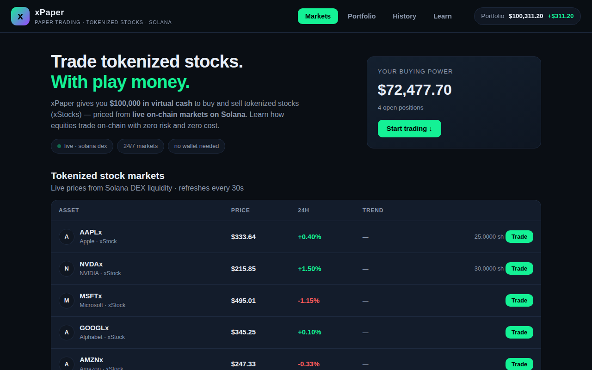

# xPaper — Paper Trading for Tokenized Stocks on Solana

Practice trading **tokenized stocks** (xStocks) with **$100,000 in virtual cash** and **live on-chain prices from Solana DEX markets**. Built for the [Stocklana Hackathon](https://hackathons.solana.com/hackathons/stocklana) ($100K main track).



## What it does

- **Virtual portfolio** — start with $100,000 in simulated USD. No wallet, no sign-up, no real funds.
- **Live reference prices** — every quote comes from real Solana DEX liquidity for xStock tokens (AAPLx, NVDAx, TSLAx, MSFTx, GOOGLx, AMZNx, METAx, NFLXx, AMDx, COINx, MSTRx, SPYx, QQQx), refreshed every 30 seconds.
- **Buy / sell at market** — virtual fills at the live reference price, with position tracking (shares, average cost, P&L per position).
- **Equity curve** — your portfolio value charted over time against your starting balance.
- **Trade history** — every fill logged with timestamp, side, shares, and price.
- **Learn tab** — plain-English explainers: what tokenized stocks are, why Solana, and honest disclaimers.

## Why Solana

Tokenized stocks only make sense on a chain fast and cheap enough to feel like a brokerage app: Solana settles in ~400ms for fractions of a cent, and xStocks already trade 24/7 in on-chain liquidity pools. xPaper simulates the trading experience on top of that real market data — the educational on-ramp for the next wave of equity traders.

## Run it locally

xPaper is a **static site** — no build step, no backend, no API keys.

```bash
git clone https://github.com/kdai03/xpaper.git
cd xpaper
python3 -m http.server 8000
# open http://localhost:8000
```

Or just open `index.html` in a browser (prices load from the public DexScreener API; an internet connection is required).

**Demo mode:** open `index.html?demo=1` to load a pre-built sample portfolio (positions, history, equity curve) — handy for screenshots.

**Reset:** the "↺ reset demo" button in the Portfolio tab restores $100,000 cash. State persists in `localStorage`.

## Architecture

```
index.html          UI shell (markets / portfolio / history / learn views, trade modal)
css/style.css       dark fintech theme, responsive
js/tokens.js        tokenized-stock universe: symbol, name, Solana mint addresses
js/app.js           portfolio engine, DexScreener polling, canvas charts, trade modal
```

- **Prices:** `GET https://api.dexscreener.com/latest/dex/tokens/{mints}` → best Solana pair per token by liquidity → `priceUsd`, 24h change, token icon. Polled every 30s. No key required.
- **State:** portfolio, trades, equity snapshots, and sparkline history in `localStorage` (`xpaper_v1`).
- **Charting:** hand-rolled canvas (no chart lib) — equity curve with start-balance baseline; SVG sparklines per row.
- **Costs:** $0 — static hosting (GitHub Pages / Vercel / any CDN), free public price API.

## Price data note

Pyth's Hermes REST API (the canonical xStock feed publisher) now requires an API key, so xPaper reads the same on-chain markets through DexScreener's free public API instead: real Solana DEX trades in xStock liquidity pools (primarily Raydium). Reference prices may lag spot by seconds and differ slightly across venues — fine for a simulator, and disclosed in-app.

## Disclaimers

- Virtual cash only. No real assets are bought, sold, or custodied.
- Educational simulator, not financial advice, not a brokerage.
- Not affiliated with Backed Finance, xStocks, Solana, or DexScreener.

## Roadmap (post-hackathon ideas)

- Limit orders & price alerts against live feeds
- Leaderboards (opt-in, serverless via signed attestations)
- Pyth pull-oracle quotes once a keyless path exists
- More xStock listings as they launch

## License

MIT — see [LICENSE](LICENSE).
